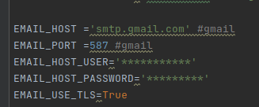
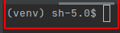
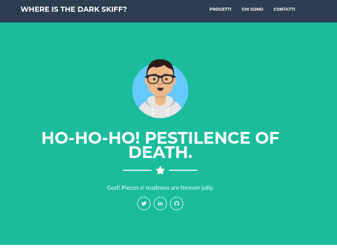

# personal-webapp
Web app da utilizzare come pagina personale, facilmente integrabile con app Blog tramite Django
Presenti static files con js e css. Il sito è in grado di gestire la ricezione delle email dal form. Necessario cambiare le impostazioni nel file **webapp/settings.py**:

# Installazione
Necessaria versione Python >=  3.x

##
- Clonare il repository:

    `git clone https://github.com/davide-piu/personal-webapp.git`

- Con Python su terminale o IDE creare nuovo virtualenv e attivarlo:

    

- Installare con pip il file requirements.txt:

    `pip install -r requirements.txt`

- Ora i requirements e Django sono installati, si può fa partire la web app su localhost:

    `python manage.py runserver`

- Aprire con il browser:
  
  `http://127.0.0.1:8000`

- Risultato: 

#### Per utilizzare admin di Django (da utilizzare solo nel caso si voglia utilizzare l'ORM di Django, ad esempio per aggiungere l'app del Blog):

`python manage.py createsuperuser`

<a href="https://www.youtube.com/watch?v=UkokhawLKDU">Questo video</a> è utile nel caso si decida di caricare la Webapp su Heroku una volta modificato l'html. Per la gestione dei file static e per la sintassi di Django per la gestione dei template si rimanda alla <a href="https://docs.djangoproject.com/en/3.1/ref/templates/language/">Documentazione</a>
  

